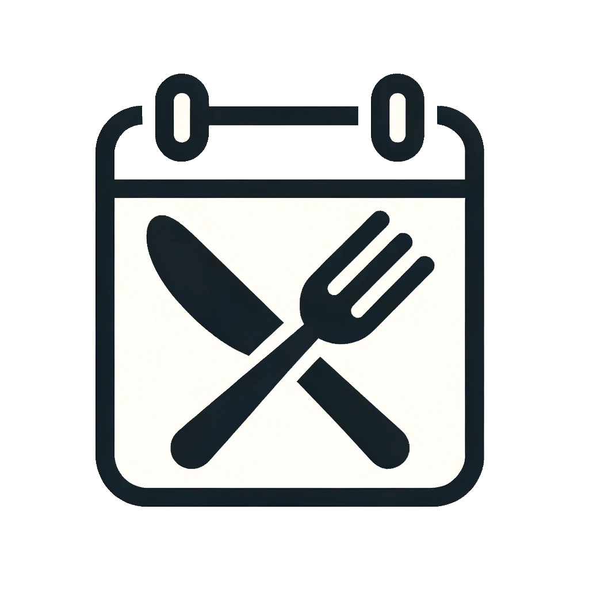

#  DinnerDeltag - [Åbn App](https://lukasjp11.github.io/DinnerDeltag/)

DinnerDeltag er en simpel webapplikation 💻 skabt specielt til en lejlighed i Brabrand, bestående af Lukas, Silas og Anton. Applikationen hjælper med at holde styr på, hvem der deltager i aftensmaden og hvem der laver mad hver dag i måneden 🍽️📅. Den er bygget med HTML, CSS og JavaScript, og er nem at bruge og tilpasse 🛠️.

## Indholdsfortegnelse

1. [Indhold 📖](#indhold)
2. [Adgang 🚪](#adgang)
3. [Brugervejledning 📚](#brugervejledning)
    - [Farveindikatorer 🎨](#farveindikatorer)
4. [Tilføj genvej til din hjemmeskærm 📱](#tilføj-genvej-til-din-hjemmeskærm)
    - [For Android-brugere](#for-android-brugere)
    - [For iOS-brugere](#for-ios-brugere)
5. [Note 📌](#note)

## Indhold 📖 

- `index.html`: Hovedfilen der indeholder strukturen af webapplikationen 🏗️.
- `css/calendarStyles.css`: CSS fil der indeholder styling specifikt til kalenderdelen af webapplikationen 📅.
- `css/modalStyles.css`: CSS fil der indeholder styling specifikt til modal-vinduet i applikationen 🪟.
- `js/app.js`: Hoved JavaScript-fil der initialiserer og styrer webapplikationen ⚙️.
- `js/calendar.js`: JavaScript-fil til at håndtere kalenderens funktionalitet og interaktion 📆.
- `js/modal.js`: JavaScript-fil til at styre modal-vinduets funktionalitet og interaktion 🖱️.
- `js/firebaseInit.js`: Initialiserer og konfigurerer forbindelsen til Firebase for realtids datahåndtering 🔥.
- `images/`: En mappe der indeholder alle billederne brugt i webapplikationen 🖼️.

## Adgang 🚪 

Du kan tilgå applikationen direkte via [GitHub Pages](https://lukasjp11.github.io/DinnerDeltag/).

Applikationen bruger Firebase som dens database for at lagre og hente data i realtid 🔄. Det sikrer, at information om deltagelse opdateres øjeblikkeligt for alle brugere 👥.

## Brugervejledning 📚 

1. Naviger mellem forskellige måneder ved hjælp af pilene øverst på kalenderen ⬅️➡️.
2. Klik på en dato for at vælge, hvem der deltager i aftensmaden på den pågældende dag 🗓️.
3. Marker hvem der deltager i måltidet, og vælg fra dropdown-menuen, hvem der skal lave mad. Marker boksen, hvis der deltager gæster ✅.
4. Klik på "Gem" for at gemme valget. Datoen vil blive farvemarkeret på kalenderen for at indikere deltagelse og hvem der laver mad 🔒.

### Farveindikatorer 🎨 

- **🟩Grøn**: En person er valgt til at lave mad, og der er deltagere til aftensmaden 🍲.
- **🟨Gul**: Der er deltagere, men ingen valgt til at lave mad ⚠️.
- **🟥Rød**: Ingen deltagere 🚫.
- **⬛Ingen farve**: Ingen data.

---

### Tilføj genvej til din hjemmeskærm 📱 

#### For Android-brugere  

1. Åbn webbrowseren (for eksempel Chrome) på din Android-enhed 🌐.
2. Gå til [DinnerDeltag](https://lukasjp11.github.io/DinnerDeltag/).
3. Tryk på de tre prikker i øverste højre hjørne for at åbne menuen ⋮.
4. Rul ned og tryk på "Tilføj til hjemmeskærm" ➕.
5. Indtast et navn for genvejen, og tryk på "Tilføj" ✏️.

#### For iOS-brugere  

1. Åbn Safari-browseren på din iOS-enhed 🌐.
2. Gå til [DinnerDeltag](https://lukasjp11.github.io/DinnerDeltag/).
3. Tryk på delingsikonet nederst på skærmen (rektangel med en pil, der peger opad) ↗️.
4. Rul til højre i den nederste række af ikoner, og tryk på "Tilføj til hjemmeskærm" ➕.
5. Indtast et navn for genvejen, og tryk på "Tilføj" ✏️.

Nu vil en genvej til DinnerDeltag-webapplikationen være tilgængelig på din enheds hjemmeskærm, hvilket gør det nemt at tilgå den når som helst 🔖.

## Note 📌 

Applikationen er designet specifikt til at imødekomme behovene i vores lejlighed og indeholder derfor predefinerede navne. 😊
